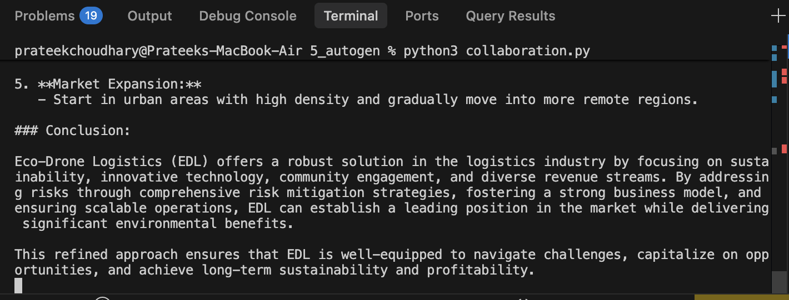

# IdeaForge: Multi-Agent Startup Incubator

IdeaForge is a Multi-Agent AI system that simulates a startup incubation workflow using collaborative AI agents powered by AutoGen, Ollama, and Qwen 2.5.

The system generates startup ideas, improves business models, critiques weaknesses, optimizes strategies, and produces investor-ready pitches through a structured multi-agent pipeline.

---

## Workflow Execution



---

## Features

* Multi-Agent Collaboration
* AI-Powered Startup Ideation
* Business Strategy Enhancement
* Risk & Market Analysis
* Startup Optimization
* Investor Pitch Generation
* Automated Markdown Report Export
* Local LLM Inference using Ollama
* End-to-End Autonomous Workflow

---

## Architecture

```text
User Prompt
     │
     ▼
┌───────────────┐
│ Agent 1       │
│ Idea Generator│
└───────┬───────┘
        ▼
┌───────────────┐
│ Agent 2       │
│ Strategist    │
└───────┬───────┘
        ▼
┌───────────────┐
│ Agent 3       │
│ Critic        │
└───────┬───────┘
        ▼
┌───────────────┐
│ Agent 4       │
│ Optimizer     │
└───────┬───────┘
        ▼
┌───────────────┐
│ Agent 5       │
│ Investor Pitch│
└───────┬───────┘
        ▼
final_startup_pitch.md
```

---

## Agent Roles

### Agent 1 — Idea Generator

* Generates innovative startup concepts
* Identifies opportunities and solutions

### Agent 2 — Business Strategist

* Enhances monetization models
* Improves scalability and revenue streams

### Agent 3 — Critic

* Evaluates risks and weaknesses
* Identifies market and execution challenges

### Agent 4 — Optimizer

* Addresses identified issues
* Improves business viability and profitability

### Agent 5 — Investor Pitch Agent

* Produces investor-ready startup pitches
* Structures funding and growth narratives

---

## Tech Stack

* Python
* AutoGen
* Ollama
* Qwen 2.5 7B
* Python Dotenv
* Markdown

---

## Project Structure

```text
IdeaForge/
│
├── agent.py
├── agent1.py
├── agent2.py
├── agent3.py
├── agent4.py
├── agent5.py
│
├── creator.py
├── collaboration.py
├── messages.py
│
├── final_startup_pitch.md
├── info.png
│
├── requirements.txt
└── README.md
```

---

## Generated Output

The workflow automatically generates a detailed report:

```text
final_startup_pitch.md
```

The report includes:

* Startup Idea
* Business Enhancement
* Risk Assessment
* Optimization Strategy
* Investor Pitch

This provides a complete startup development lifecycle generated through collaborative AI reasoning.

---

## Running the Project

```bash
python3 collaboration.py
```

Successful execution:

```text
WORKFLOW COMPLETE
Output saved to final_startup_pitch.md
```

---

## Key Learnings

* Multi-Agent System Design
* Agent Collaboration Patterns
* Reflection & Critique Workflows
* Prompt Engineering
* AI Orchestration
* Local LLM Deployment with Ollama
* End-to-End AI Application Development

---

## Future Enhancements

* Agent Debate Loops
* Judge Agent for Startup Scoring
* Market Research Agent
* Startup Valuation Agent
* Streamlit Dashboard
* PDF Report Generation

---

## Author

**Prateek Choudhary**

Built to explore Multi-Agent AI Systems, collaborative reasoning, and autonomous startup incubation workflows using AutoGen and Ollama.
